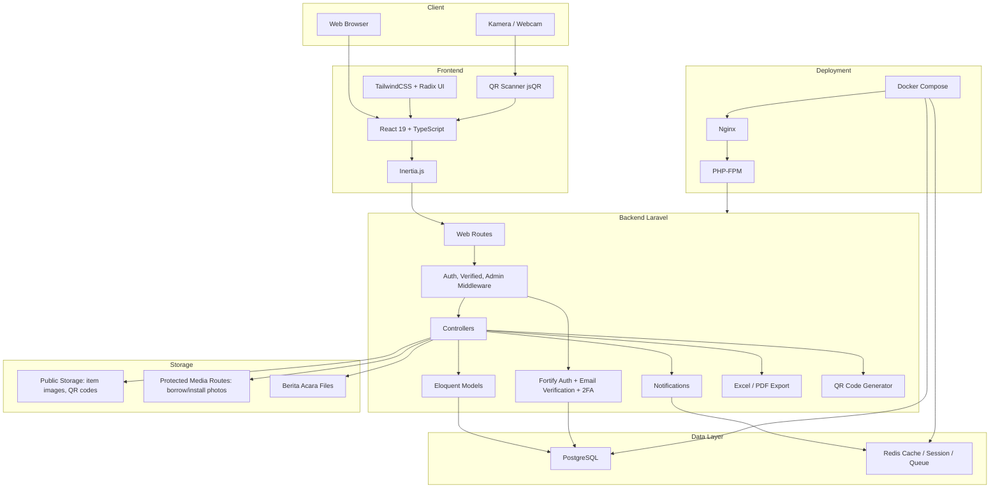
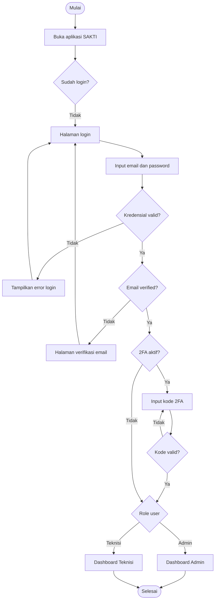
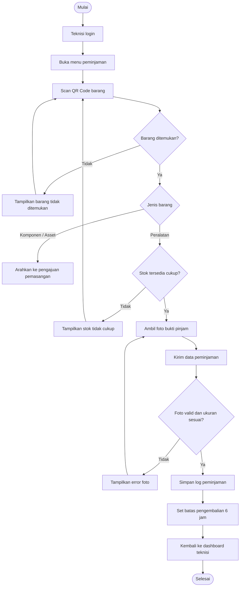
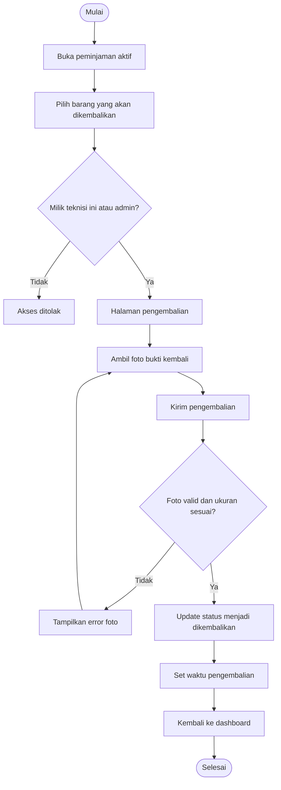
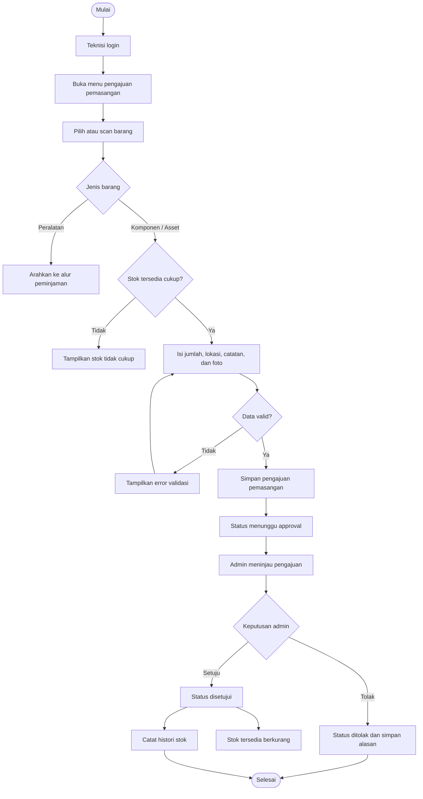
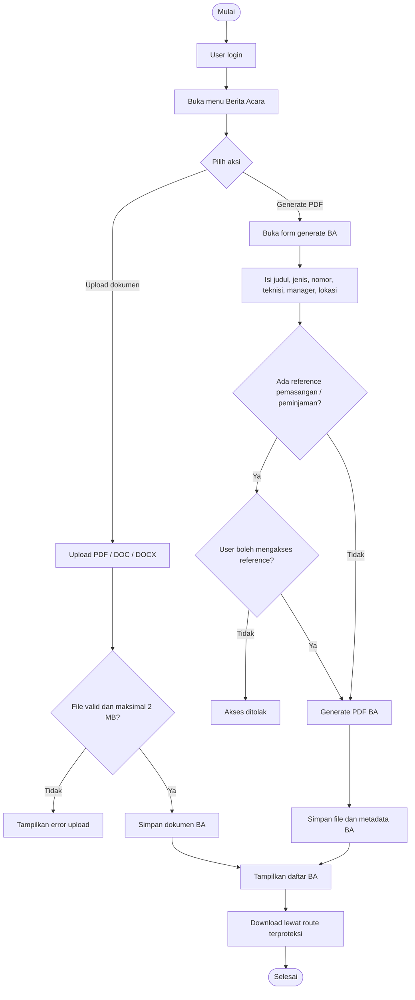

# Diagram SAKTI

Dokumen ini berisi block diagram, flowchart, dan use case diagram untuk aplikasi SAKTI.
Diagram dibuat dalam format Mermaid agar mudah dirender di Markdown, VS Code, GitHub, atau dokumentasi teknis.

## 1. Block Diagram Sistem

## 2. Flowchart Login dan Akses Role

## 3. Flowchart Peminjaman Peralatan

## 4. Flowchart Pengembalian Peralatan

## 5. Flowchart Pengajuan Pemasangan Komponen / Asset

## 6. Flowchart Berita Acara

## 7. Use Case Diagram

```mermaid
flowchart LR
    Admin((Admin))
    Teknisi((Teknisi))

    subgraph Auth["Autentikasi"]
        UCLogin["Login"]
        UCLogout["Logout"]
        UCVerify["Verifikasi Email"]
        UC2FA["Kelola 2FA"]
        UCProfile["Kelola Profil"]
    end

    subgraph Inventory["Inventaris"]
        UCViewDashboard["Lihat Dashboard"]
        UCManageItems["Kelola Barang"]
        UCManageCategories["Kelola Kategori"]
        UCViewQR["Lihat / Cetak QR Code"]
        UCExportItems["Export Excel / PDF"]
        UCAuditStock["Lihat Audit Stok"]
        UCStockAnalytics["Lihat Analitik Stok"]
    end

    subgraph Borrowing["Peminjaman Peralatan"]
        UCScanBorrow["Scan QR Barang"]
        UCBorrowItem["Pinjam Peralatan"]
        UCReturnItem["Kembalikan Peralatan"]
        UCViewOwnBorrowings["Lihat Riwayat Peminjaman Sendiri"]
        UCManageBorrowings["Kelola Semua Peminjaman"]
    end

    subgraph Installation["Pemasangan Komponen / Asset"]
        UCRequestInstall["Ajukan Pemasangan"]
        UCViewOwnInstall["Lihat Riwayat Pemasangan Sendiri"]
        UCApproveInstall["Approve Pemasangan"]
        UCRejectInstall["Tolak Pemasangan"]
        UCManageInstall["Kelola Semua Pemasangan"]
    end

    subgraph BA["Berita Acara"]
        UCUploadBA["Upload Berita Acara"]
        UCGenerateBA["Generate PDF Berita Acara"]
        UCDownloadBA["Download Berita Acara"]
        UCDeleteBA["Hapus Berita Acara"]
    end

    subgraph Notification["Notifikasi"]
        UCReadNotif["Baca Notifikasi"]
        UCMarkNotif["Tandai Notifikasi Dibaca"]
    end

    Admin --> UCLogin
    Admin --> UCLogout
    Admin --> UCVerify
    Admin --> UC2FA
    Admin --> UCProfile
    Admin --> UCViewDashboard
    Admin --> UCManageItems
    Admin --> UCManageCategories
    Admin --> UCViewQR
    Admin --> UCExportItems
    Admin --> UCAuditStock
    Admin --> UCStockAnalytics
    Admin --> UCManageBorrowings
    Admin --> UCManageInstall
    Admin --> UCApproveInstall
    Admin --> UCRejectInstall
    Admin --> UCUploadBA
    Admin --> UCGenerateBA
    Admin --> UCDownloadBA
    Admin --> UCDeleteBA
    Admin --> UCReadNotif
    Admin --> UCMarkNotif

    Teknisi --> UCLogin
    Teknisi --> UCLogout
    Teknisi --> UCVerify
    Teknisi --> UC2FA
    Teknisi --> UCProfile
    Teknisi --> UCViewDashboard
    Teknisi --> UCScanBorrow
    Teknisi --> UCBorrowItem
    Teknisi --> UCReturnItem
    Teknisi --> UCViewOwnBorrowings
    Teknisi --> UCRequestInstall
    Teknisi --> UCViewOwnInstall
    Teknisi --> UCUploadBA
    Teknisi --> UCGenerateBA
    Teknisi --> UCDownloadBA
    Teknisi --> UCReadNotif
    Teknisi --> UCMarkNotif
```

## 8. Use Case Ringkas

| Aktor | Use Case Utama |
| --- | --- |
| Admin | Mengelola barang, kategori, peminjaman, pemasangan, audit stok, analitik stok, export, dan berita acara |
| Teknisi | Melihat dashboard, scan QR, meminjam peralatan, mengembalikan peralatan, mengajukan pemasangan, dan mengelola berita acara miliknya |
| Sistem | Autentikasi, validasi role, generate QR, validasi upload, mencatat histori, mengirim notifikasi, dan membuat file PDF/Excel |

